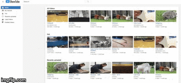

# ShareTube

[ShareTube Live](https://sharetube.herokuapp.com/?#/)

ShareTube is a full-stack web application modeled after YouTube. It is built using Ruby on Rails, a Postgresql database, and React.js with a Redux framework on the frontend.

## App Features and Implementation

### Video Player

Videos are uploaded and stored using an attachment library called `PaperClip` and Amazon Web Services(AWS). When a video page is accessed by a user, an asynchronous API call is made to the database, retrieving the video itself, its comments, other information regarding the video(title, description, etc). While the page begins rendering, the API call passes these new props into the `VideoDetailContainer`, where the `VideoDetail` component obtains its state information.

A custom video player was made using the standard HTML video element and React lifecycle method. A challenge I faced was writing the functionality behind the volume bar. Standard click handlers in React are only able to select the HTML element itself, but have limited access to the relative position of the click within the element.

<!-- ### Comments, Likes, Subscriptions

#### Comments
If logged in, users are able to make, create, and edit comments on a video. Comments have a `belongs_to` association with videos and users.

#### Likes
Users are also able to like and dislike videos and comments. Likes have a polymorphic association between videos and comments while having a `belongs_to` relationship with users.

#### Subscriptions -->

### Search and Video Filtering

#### Search
On the backend, search is deployed using Pg_Search's `pg_search_scope` search option within the Video model:

```ruby
pg_search_scope :basic_search,
  against: { title: 'A', description: 'B' },
  using: {
    dmetaphone: { any_word:  true },
    tsearch: { dictionary: "english", prefix: true },
    trigram: { threshold: 0.1 }
  }
```
The `title` and `description` columns are searched with title having a higher search priority. DMetaphone uses the `fuzzystrmatch` Postgresql extension to match words based on phonemes. TSearch implements SQL's `LIKE` functionality. Trigram uses 3-character substrings to match with the search query. `basic_search` was used to filter videos to send back to the front end.

#### Filter

The filtering functionality that provides "hot", "recent", "liked" videos are controlled in the back end. Filtering is done using ActiveRecord/SQL methods to manipulate what videos are returned.

### Home Page Carousels

Several carousels were created for the home page using the `nuka-carousel` Node Package. This allows for the animation of the carousel when toggling left and right.

Using the filter functionality in the backend, each carousel receives a different set of videos, which represents a different category. Furthermore, on the left dropdown menu, users can toggle through each category to display the category at the top of the list.

<p align="center"></img></p>


## Future Directions

With the features already implemented, I plan to continue working on the project with the following features.

### Channel Pages

 YouTube's site has channels with extensive information about a particular user's activity. I plan to add channels, allowing users to be able to see information about another user, such as their liked videos, subscriptions, recent uploads, etc.

### History

An implementation I would like to explore is having a user history. My prospective approach to implementing history would be to create a polymorphic association with a history table, connecting with videos and users. Though potentially difficult, history opens many doors towards a more extensive app.

### Recommendations

Part of what makes YouTube such a frequently visited site is its ability to offer recommendations to users. Usually, this is implemented using factors such as watch history, subscriptions, liked videos, etc. I plan to generate a simple relevance index that is able to used to generate recommendations to a user.

### Thumbnail GIFS

One of YouTube's recent additions was the playing of a GIF of the video when a user hovers over a thumbnail. Currently, my app uses PaperClip to autogenerate a thumbnail for the video. I would write a configuration for PaperClip to extract multiple thumbnails, create a GIF, and assign it to the video model.
